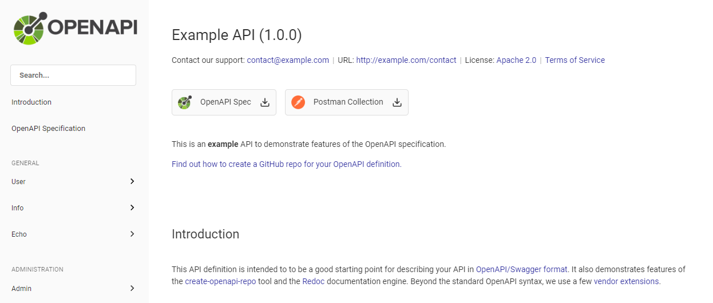

# OpenAPI Starter

Upgraded version of Redocly's [openapi-starter](https://github.com/Redocly/openapi-starter) repository with some features like:

-   Generate postman collection on build
-   Visual improvements (font, border-radius, padding etc.)
-   GitHub workflow for lint

## Screenshot

## Commands

List of available commands.

| Command           | Description                           |
| ----------------- | ------------------------------------- |
| `npm run dev`     | Start a dev server with auto refresh. |
| `npm run build`   | Build static files.                   |
| `npm run preview` | Preview the builded version.          |
| `npm run lint`    | Check the OpenAPI spec.               |
